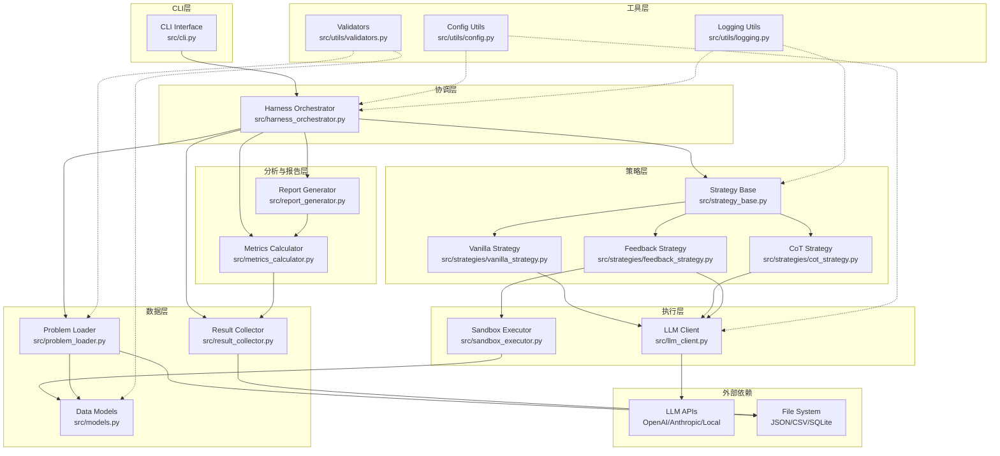
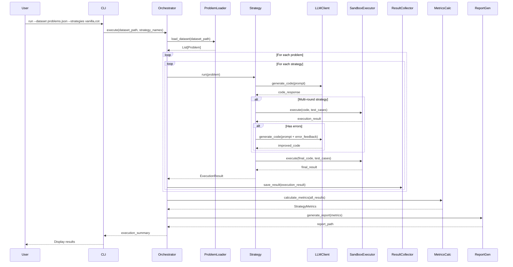
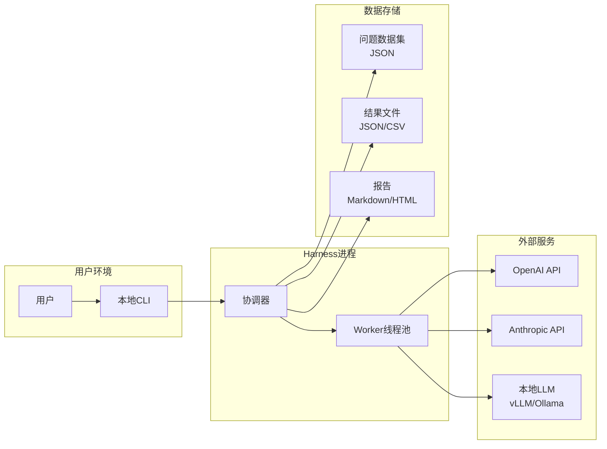

# LLM-Algorithm-Harness 系统架构设计

## 1. 架构概览

LLM-Algorithm-Harness 采用**分层架构**和**插件化设计**，确保模块解耦、易于扩展和测试。

### 1.1 总体架构图



### 1.2 数据流图



## 2. 分层设计

### 2.1 CLI层（表示层）

**职责**：
- 解析命令行参数
- 加载配置文件
- 调用协调层执行任务
- 格式化输出结果

**关键组件**：
- `src/cli.py`：Click命令定义，参数验证

**依赖**：
- 下游：Orchestrator
- 工具：ConfigUtils, LoggingUtils

### 2.2 协调层（业务逻辑层）

**职责**：
- 编排整个执行流程
- 管理并发执行（线程池/进程池）
- 错误处理和重试
- 进度监控

**关键组件**：
- `src/harness_orchestrator.py`

**依赖**：
- 上游：CLI
- 下游：ProblemLoader, Strategy, ResultCollector, MetricsCalc, ReportGen

### 2.3 策略层（业务规则层）

**职责**：
- 定义策略抽象接口
- 实现具体Harness策略
- 管理策略注册和发现

**关键组件**：
- `src/strategy_base.py`：抽象基类
- `src/strategies/vanilla_strategy.py`
- `src/strategies/cot_strategy.py`
- `src/strategies/feedback_strategy.py`

**设计模式**：
- **策略模式**：统一接口，不同策略可互换
- **模板方法模式**：基类定义骨架，子类实现细节
- **注册模式**：通过装饰器自动注册策略

### 2.4 执行层（服务层）

**职责**：
- LLM API调用和响应处理
- 代码沙箱执行
- 资源管理和限制

**关键组件**：
- `src/llm_client.py`：多Provider支持，重试机制
- `src/sandbox_executor.py`：RestrictedPython封装

**依赖**：
- 外部：LLM APIs（OpenAI/Anthropic）
- 内部：Models

### 2.5 数据层（持久化层）

**职责**：
- 数据模型定义
- 数据加载和验证
- 结果持久化

**关键组件**：
- `src/models.py`：Pydantic数据模型
- `src/problem_loader.py`：JSON解析和验证
- `src/result_collector.py`：结果存储（JSON/CSV/SQLite）

### 2.6 分析与报告层

**职责**：
- 指标计算
- 统计分析
- 报告生成

**关键组件**：
- `src/metrics_calculator.py`：NumPy/SciPy统计计算
- `src/report_generator.py`：Markdown生成，Matplotlib图表

### 2.7 工具层（基础设施层）

**职责**：
- 配置管理
- 日志记录
- 通用验证

**关键组件**：
- `src/utils/config.py`
- `src/utils/logging.py`
- `src/utils/validators.py`

## 3. 核心组件设计

### 3.1 Harness Orchestrator（协调器）

```python
class HarnessOrchestrator:
    """主协调器，负责整个评测流程的编排"""
    
    def __init__(self, config: HarnessConfig):
        self.config = config
        self.problem_loader = ProblemLoader()
        self.result_collector = ResultCollector(config.output_dir)
        self.metrics_calculator = MetricsCalculator()
        self.report_generator = ReportGenerator()
        self.executor = ThreadPoolExecutor(max_workers=config.max_workers)
    
    def run(self, dataset_path: str, strategy_names: List[str]) -> ExecutionSummary:
        """执行完整评测流程"""
        # 1. 加载问题数据集
        problems = self.problem_loader.load(dataset_path)
        
        # 2. 初始化策略
        strategies = [StrategyRegistry.get(name) for name in strategy_names]
        
        # 3. 并行执行评测
        results = self._execute_parallel(problems, strategies)
        
        # 4. 计算指标
        metrics = self.metrics_calculator.calculate(results)
        
        # 5. 生成报告
        report_path = self.report_generator.generate(metrics, results)
        
        return ExecutionSummary(
            total_problems=len(problems),
            total_strategies=len(strategies),
            metrics=metrics,
            report_path=report_path
        )
    
    def _execute_parallel(self, problems, strategies):
        """并行执行策略-问题组合"""
        tasks = [
            (problem, strategy) 
            for problem in problems 
            for strategy in strategies
        ]
        
        results = []
        with tqdm(total=len(tasks)) as pbar:
            futures = [
                self.executor.submit(self._execute_single, prob, strat)
                for prob, strat in tasks
            ]
            
            for future in as_completed(futures):
                try:
                    result = future.result()
                    results.append(result)
                    self.result_collector.save(result)
                except Exception as e:
                    logger.error(f"Task failed: {e}")
                finally:
                    pbar.update(1)
        
        return results
    
    def _execute_single(self, problem, strategy):
        """执行单个策略-问题组合"""
        llm_client = LLMClient(self.config.llm_config)
        sandbox = SandboxExecutor(self.config.sandbox_config)
        
        return strategy.run(problem, llm_client, sandbox)
```

**关键设计决策**：
- 使用线程池实现并发（IO密集型任务）
- 每个任务独立，失败不影响其他任务
- 实时保存结果，支持中断恢复

### 3.2 Strategy（策略）

```python
# 抽象基类
class Strategy(ABC):
    def __init__(self, config: StrategyConfig):
        self.config = config
    
    @abstractmethod
    def run(self, problem: Problem, llm_client: LLMClient, 
            sandbox: SandboxExecutor) -> ExecutionResult:
        """执行策略，求解问题"""
        pass
    
    @property
    @abstractmethod
    def name(self) -> str:
        """策略名称"""
        pass
    
    def _extract_code(self, response: str) -> str:
        """从LLM响应中提取Python代码"""
        # 正则匹配 ```python ... ```
        pattern = r'```python\s*(.*?)\s*```'
        match = re.search(pattern, response, re.DOTALL)
        if match:
            return match.group(1)
        raise CodeExtractionError("No Python code block found")

# Vanilla策略实现
@register_strategy("vanilla")
class VanillaStrategy(Strategy):
    @property
    def name(self) -> str:
        return "vanilla"
    
    def run(self, problem, llm_client, sandbox):
        # 1. 构建prompt
        prompt = self._build_prompt(problem)
        
        # 2. 调用LLM生成代码
        response = llm_client.generate(prompt, max_tokens=self.config.max_tokens)
        code = self._extract_code(response.text)
        
        # 3. 沙箱执行
        exec_result = sandbox.execute(code, problem.test_cases)
        
        # 4. 构建结果
        return ExecutionResult(
            problem_id=problem.problem_id,
            strategy_name=self.name,
            generated_code=code,
            status=exec_result.status,
            test_results=exec_result.test_results,
            iterations=1,
            total_tokens=response.usage.total_tokens,
            execution_time_seconds=exec_result.execution_time
        )
    
    def _build_prompt(self, problem):
        return f"""Solve the following algorithmic problem in Python:

Problem: {problem.title}
Description: {problem.description}
Constraints: {problem.constraints}

Requirements:
1. Implement a function named 'solution' that solves the problem
2. The function should accept the input parameters as specified
3. Return the expected output

Provide only the Python code, wrapped in a markdown code block.
"""

# Feedback策略实现（多轮迭代）
@register_strategy("feedback")
class FeedbackStrategy(Strategy):
    @property
    def name(self) -> str:
        return "feedback"
    
    def run(self, problem, llm_client, sandbox):
        prompt = self._build_initial_prompt(problem)
        iterations = 0
        total_tokens = 0
        
        for i in range(self.config.max_iterations):
            iterations += 1
            
            # 生成代码
            response = llm_client.generate(prompt)
            code = self._extract_code(response.text)
            total_tokens += response.usage.total_tokens
            
            # 执行测试
            exec_result = sandbox.execute(code, problem.test_cases)
            
            # 如果成功，返回结果
            if exec_result.all_passed:
                return ExecutionResult(
                    problem_id=problem.problem_id,
                    strategy_name=self.name,
                    generated_code=code,
                    status="success",
                    test_results=exec_result.test_results,
                    iterations=iterations,
                    total_tokens=total_tokens,
                    execution_time_seconds=exec_result.execution_time
                )
            
            # 构建反馈prompt
            prompt = self._build_feedback_prompt(
                problem, code, exec_result
            )
        
        # 达到最大迭代次数
        return ExecutionResult(
            problem_id=problem.problem_id,
            strategy_name=self.name,
            generated_code=code,
            status="max_iterations_reached",
            test_results=exec_result.test_results,
            iterations=iterations,
            total_tokens=total_tokens,
            execution_time_seconds=exec_result.execution_time
        )
    
    def _build_feedback_prompt(self, problem, code, exec_result):
        failed_cases = [tc for tc in exec_result.test_results if not tc.passed]
        
        feedback = f"""Your previous code failed on some test cases. Please fix it.

Original Problem:
{problem.description}

Your Previous Code:
```python
{code}
```

Failed Test Cases:
"""
        for tc in failed_cases[:3]:  # 只展示前3个失败案例
            feedback += f"""
- Input: {tc.input}
- Expected: {tc.expected_output}
- Got: {tc.actual_output}
- Error: {tc.error_message or 'Wrong answer'}
"""
        
        feedback += "\nProvide the corrected Python code:"
        return feedback
```

**关键设计决策**：
- 策略注册采用装饰器模式，自动注册到全局registry
- 基类提供通用方法（如代码提取），子类专注策略逻辑
- Feedback策略实现自动迭代，带early stopping

### 3.3 LLM Client（LLM客户端）

```python
class LLMClient:
    """LLM API客户端，支持多Provider"""
    
    def __init__(self, config: LLMConfig):
        self.config = config
        self.provider = self._init_provider(config.provider)
        self.retry_config = ExponentialBackoff(
            max_retries=3,
            base_delay=1.0,
            max_delay=60.0
        )
    
    def _init_provider(self, provider_name: str):
        """初始化Provider"""
        if provider_name == "openai":
            return OpenAIProvider(api_key=self.config.api_key)
        elif provider_name == "anthropic":
            return AnthropicProvider(api_key=self.config.api_key)
        elif provider_name == "local":
            return LocalProvider(base_url=self.config.base_url)
        else:
            raise ValueError(f"Unknown provider: {provider_name}")
    
    @retry_with_backoff
    def generate(self, prompt: str, **kwargs) -> LLMResponse:
        """
        生成代码
        
        Args:
            prompt: 输入提示
            **kwargs: 额外参数（temperature, max_tokens等）
            
        Returns:
            LLMResponse: 包含生成文本和token使用量
        """
        try:
            response = self.provider.complete(
                prompt=prompt,
                temperature=kwargs.get('temperature', self.config.temperature),
                max_tokens=kwargs.get('max_tokens', self.config.max_tokens),
                timeout=self.config.timeout
            )
            
            return LLMResponse(
                text=response.text,
                usage=TokenUsage(
                    prompt_tokens=response.usage.prompt_tokens,
                    completion_tokens=response.usage.completion_tokens,
                    total_tokens=response.usage.total_tokens
                ),
                model=response.model
            )
        
        except RateLimitError as e:
            logger.warning(f"Rate limit hit, will retry: {e}")
            raise  # 让retry装饰器处理
        
        except APIError as e:
            logger.error(f"API error: {e}")
            raise
```

**关键设计决策**：
- 抽象Provider接口，支持多个LLM服务
- 装饰器实现重试逻辑，与业务代码解耦
- 统一的响应格式，屏蔽Provider差异

### 3.4 Sandbox Executor（沙箱执行器）

```python
class SandboxExecutor:
    """安全的代码沙箱执行器"""
    
    def __init__(self, config: SandboxConfig):
        self.config = config
        self.timeout = config.timeout_seconds
        self.memory_limit = config.memory_limit_mb
    
    def execute(self, code: str, test_cases: List[TestCase]) -> SandboxResult:
        """
        在沙箱中执行代码并运行测试用例
        
        Args:
            code: 要执行的Python代码
            test_cases: 测试用例列表
            
        Returns:
            SandboxResult: 执行结果
        """
        # 1. 编译代码（检查语法）
        try:
            compiled_code = compile_restricted(
                code,
                filename='<generated>',
                mode='exec'
            )
        except SyntaxError as e:
            return SandboxResult(
                status="syntax_error",
                error_message=str(e),
                test_results=[],
                execution_time=0
            )
        
        # 2. 运行测试用例
        test_results = []
        total_time = 0
        
        for i, test_case in enumerate(test_cases):
            result = self._run_single_test(compiled_code, test_case, i)
            test_results.append(result)
            total_time += result.execution_time
            
            # 如果出现严重错误（超时、内存），停止后续测试
            if result.status in ["timeout", "memory_error"]:
                break
        
        # 3. 判断整体状态
        all_passed = all(tc.passed for tc in test_results)
        status = "success" if all_passed else "failed"
        
        return SandboxResult(
            status=status,
            test_results=test_results,
            execution_time=total_time,
            all_passed=all_passed
        )
    
    def _run_single_test(self, compiled_code, test_case, index):
        """运行单个测试用例"""
        # 创建受限的全局命名空间
        restricted_globals = self._create_safe_globals()
        
        # 使用multiprocessing实现超时和资源限制
        queue = multiprocessing.Queue()
        process = multiprocessing.Process(
            target=self._execute_in_process,
            args=(compiled_code, test_case, restricted_globals, queue)
        )
        
        start_time = time.time()
        process.start()
        process.join(timeout=self.timeout)
        execution_time = time.time() - start_time
        
        if process.is_alive():
            # 超时，终止进程
            process.terminate()
            process.join()
            return TestCaseResult(
                test_case_index=index,
                passed=False,
                status="timeout",
                error_message=f"Execution exceeded {self.timeout}s timeout"
            )
        
        # 获取执行结果
        if not queue.empty():
            result_data = queue.get()
            if result_data['success']:
                actual_output = result_data['output']
                expected = test_case.expected_output
                passed = self._compare_outputs(actual_output, expected)
                
                return TestCaseResult(
                    test_case_index=index,
                    passed=passed,
                    actual_output=actual_output,
                    expected_output=expected,
                    execution_time=execution_time
                )
            else:
                return TestCaseResult(
                    test_case_index=index,
                    passed=False,
                    status="runtime_error",
                    error_message=result_data['error'],
                    execution_time=execution_time
                )
        
        return TestCaseResult(
            test_case_index=index,
            passed=False,
            status="unknown_error",
            error_message="Process terminated without result"
        )
    
    def _create_safe_globals(self):
        """创建安全的全局命名空间"""
        from RestrictedPython import safe_builtins, limited_builtins
        
        safe_globals = {
            '__builtins__': {
                **limited_builtins,
                'len': len,
                'range': range,
                'enumerate': enumerate,
                'zip': zip,
                'map': map,
                'filter': filter,
                'sorted': sorted,
                'sum': sum,
                'min': min,
                'max': max,
                'abs': abs,
                'int': int,
                'float': float,
                'str': str,
                'list': list,
                'dict': dict,
                'set': set,
                'tuple': tuple,
            }
        }
        
        # 禁止导入危险模块
        safe_globals['__import__'] = self._restricted_import
        
        return safe_globals
    
    def _restricted_import(self, name, *args, **kwargs):
        """限制可导入的模块"""
        ALLOWED_MODULES = {
            'math', 'itertools', 'collections', 
            'heapq', 'bisect', 'functools'
        }
        
        if name not in ALLOWED_MODULES:
            raise ImportError(f"Import of '{name}' is not allowed")
        
        return __import__(name, *args, **kwargs)
    
    def _compare_outputs(self, actual, expected):
        """比较输出（支持多种类型）"""
        if type(actual) != type(expected):
            return False
        
        if isinstance(actual, (list, tuple)):
            return len(actual) == len(expected) and all(
                self._compare_outputs(a, e) 
                for a, e in zip(actual, expected)
            )
        
        if isinstance(actual, float):
            return abs(actual - expected) < 1e-6
        
        return actual == expected
```

**关键设计决策**：
- 使用RestrictedPython限制代码能力
- 使用multiprocessing实现真正的隔离和超时
- 白名单机制控制可用模块
- 支持多种输出类型的智能比较

## 4. 外部依赖

### 4.1 LLM APIs

**OpenAI API**：
- 模型：gpt-3.5-turbo, gpt-4
- SDK：`openai` Python包
- 认证：API Key

**Anthropic API**：
- 模型：claude-3-haiku, claude-3-sonnet
- SDK：`anthropic` Python包
- 认证：API Key

**本地模型**：
- 兼容OpenAI格式的本地服务
- 部署方案：vLLM, Ollama, TGI
- 通信：HTTP REST API

### 4.2 沙箱库

**RestrictedPython**：
- 用途：限制Python代码执行能力
- 特性：禁止文件IO、网络、危险函数
- 替代方案：PyPy sandbox (更重)

### 4.3 数据存储

**JSON**：
- 用途：问题数据集、结果导出
- 库：标准库 `json`

**CSV**：
- 用途：表格化结果导出（Excel分析）
- 库：`pandas`

**SQLite**（可选）：
- 用途：大规模结果查询
- 库：标准库 `sqlite3`

### 4.4 分析与可视化

**NumPy**：统计计算  
**SciPy**：t检验、置信区间  
**pandas**：数据处理  
**Matplotlib**：图表生成

## 5. 技术栈总结

| 层次 | 技术选型 | 理由 |
|-----|---------|------|
| 语言 | Python 3.10+ | 类型提示、match-case、生态丰富 |
| CLI | Click | 声明式API，自动生成帮助文档 |
| 数据验证 | Pydantic | 自动验证、序列化、IDE支持 |
| LLM SDK | openai, anthropic | 官方SDK，稳定可靠 |
| 沙箱 | RestrictedPython + multiprocessing | 安全隔离，资源限制 |
| 测试 | pytest, pytest-cov | 生态最成熟，插件丰富 |
| 类型检查 | mypy | 静态类型检查，减少运行时错误 |
| 代码规范 | ruff | 快速linter，合并多工具功能 |
| 配置 | YAML | 人类可读，支持注释 |
| 日志 | structlog | 结构化日志，易于分析 |
| 并发 | ThreadPoolExecutor | IO密集型，GIL影响小 |

## 6. 部署架构



**部署要求**：
- Python 3.10+
- 4核CPU（支持5并发）
- 16GB RAM
- 网络连接（API调用）
- 存储：1GB（代码+依赖+数据）

---

**文档版本**：v1.0  
**创建日期**：2026-09-14  
**对应Spec版本**：v1.0
