# 核心数据结构文档

## 1. 数据结构概览

本文档定义所有核心数据结构，使用 **Pydantic BaseModel** 实现，提供：
- 自动类型验证
- JSON序列化/反序列化
- IDE类型提示支持
- 文档生成

## 2. 问题相关数据结构

### 2.1 TestCase（测试用例）

```python
from pydantic import BaseModel, Field
from typing import Dict, Any

class TestCase(BaseModel):
    """单个测试用例"""
    
    input: Dict[str, Any] = Field(
        ...,
        description="测试输入，键为参数名，值为参数值"
    )
    expected_output: Any = Field(
        ...,
        description="预期输出，可以是任意JSON可序列化类型"
    )
    
    class Config:
        json_schema_extra = {
            "example": {
                "input": {"nums": [2, 7, 11, 15], "target": 9},
                "expected_output": [0, 1]
            }
        }
```

**字段说明**：
- `input`: 字典类型，键是函数参数名，值是参数值
- `expected_output`: 任意类型，与函数返回值类型对应

**使用示例**：
```python
tc = TestCase(
    input={"nums": [2, 7, 11, 15], "target": 9},
    expected_output=[0, 1]
)
```

---

### 2.2 Problem（算法问题）

```python
from typing import List, Optional, Literal

class Problem(BaseModel):
    """算法问题定义"""
    
    problem_id: str = Field(
        ...,
        description="问题唯一标识符，如 'leetcode-001'",
        min_length=1
    )
    title: str = Field(
        ...,
        description="问题标题",
        min_length=1
    )
    description: str = Field(
        ...,
        description="问题详细描述",
        min_length=10
    )
    difficulty: Literal["easy", "medium", "hard"] = Field(
        ...,
        description="难度级别"
    )
    tags: List[str] = Field(
        default_factory=list,
        description="问题标签，如 ['array', 'hash-table']"
    )
    test_cases: List[TestCase] = Field(
        ...,
        description="测试用例列表，至少包含1个",
        min_length=1
    )
    constraints: Optional[str] = Field(
        None,
        description="问题约束条件"
    )
    
    def validate_completeness(self) -> bool:
        """验证问题数据完整性"""
        return (
            bool(self.problem_id) and
            bool(self.title) and
            bool(self.description) and
            len(self.test_cases) > 0 and
            self.difficulty in ["easy", "medium", "hard"]
        )
    
    class Config:
        json_schema_extra = {
            "example": {
                "problem_id": "leetcode-001",
                "title": "Two Sum",
                "description": "Given an array of integers nums...",
                "difficulty": "easy",
                "tags": ["array", "hash-table"],
                "test_cases": [
                    {
                        "input": {"nums": [2, 7, 11, 15], "target": 9},
                        "expected_output": [0, 1]
                    }
                ],
                "constraints": "2 <= nums.length <= 10^4"
            }
        }
```

**字段说明**：
- `problem_id`: 唯一标识符，用于结果关联
- `difficulty`: 枚举类型，只能是 easy/medium/hard
- `test_cases`: 至少包含1个测试用例
- `constraints`: 可选，描述输入约束

**校验规则**：
- 所有必填字段不能为空
- `test_cases` 至少包含1个元素
- `difficulty` 必须在枚举值范围内

---

## 3. 执行相关数据结构

### 3.1 TestCaseResult（测试用例执行结果）

```python
class TestCaseResult(BaseModel):
    """单个测试用例的执行结果"""
    
    test_case_index: int = Field(
        ...,
        description="测试用例索引（从0开始）",
        ge=0
    )
    passed: bool = Field(
        ...,
        description="是否通过"
    )
    actual_output: Any = Field(
        None,
        description="实际输出"
    )
    expected_output: Any = Field(
        None,
        description="预期输出"
    )
    error_message: Optional[str] = Field(
        None,
        description="错误消息（如果失败）"
    )
    execution_time: float = Field(
        0.0,
        description="执行时间（秒）",
        ge=0
    )
    
    class Config:
        json_schema_extra = {
            "example": {
                "test_case_index": 0,
                "passed": True,
                "actual_output": [0, 1],
                "expected_output": [0, 1],
                "error_message": None,
                "execution_time": 0.002
            }
        }
```

**字段说明**：
- `passed`: 布尔值，表示是否通过
- `actual_output`: 代码实际返回值
- `expected_output`: 来自TestCase的预期值
- `error_message`: 失败时的错误描述（运行时错误、错误答案等）

---

### 3.2 SandboxResult（沙箱执行结果）

```python
class SandboxResult(BaseModel):
    """沙箱执行的聚合结果"""
    
    status: Literal["success", "failed", "timeout", "memory_error", "syntax_error", "runtime_error"] = Field(
        ...,
        description="执行状态"
    )
    test_results: List[TestCaseResult] = Field(
        default_factory=list,
        description="所有测试用例的结果"
    )
    execution_time: float = Field(
        0.0,
        description="总执行时间（秒）",
        ge=0
    )
    all_passed: bool = Field(
        False,
        description="是否所有测试用例都通过"
    )
    error_message: Optional[str] = Field(
        None,
        description="全局错误消息（如语法错误、导入错误）"
    )
    
    class Config:
        json_schema_extra = {
            "example": {
                "status": "success",
                "test_results": [...],
                "execution_time": 0.015,
                "all_passed": True,
                "error_message": None
            }
        }
```

**状态枚举**：
- `success`: 所有测试通过
- `failed`: 部分测试失败（逻辑错误）
- `timeout`: 执行超时
- `memory_error`: 内存超限
- `syntax_error`: 语法错误
- `runtime_error`: 运行时错误（如除零、类型错误）

---

### 3.3 ExecutionResult（策略执行结果）

```python
from datetime import datetime

class ExecutionResult(BaseModel):
    """策略执行一个问题的完整结果"""
    
    problem_id: str = Field(..., description="问题ID")
    strategy_name: str = Field(..., description="策略名称")
    generated_code: str = Field(..., description="生成的代码")
    status: str = Field(..., description="执行状态")
    test_results: List[TestCaseResult] = Field(
        default_factory=list,
        description="测试用例结果"
    )
    error_message: Optional[str] = Field(
        None,
        description="错误消息"
    )
    iterations: int = Field(
        1,
        description="迭代次数（多轮策略）",
        ge=1
    )
    total_tokens: int = Field(
        0,
        description="总token消耗",
        ge=0
    )
    execution_time_seconds: float = Field(
        0.0,
        description="执行时间（秒）",
        ge=0
    )
    timestamp: str = Field(
        default_factory=lambda: datetime.now().isoformat(),
        description="时间戳（ISO格式）"
    )
    llm_traces: List[Dict[str, Any]] = Field(
        default_factory=list,
        description="LLM交互trace（用于调试）"
    )
    
    def is_successful(self) -> bool:
        """判断是否成功"""
        return self.status == "success" and all(
            tc.passed for tc in self.test_results
        )
    
    class Config:
        json_schema_extra = {
            "example": {
                "problem_id": "leetcode-001",
                "strategy_name": "vanilla",
                "generated_code": "def solution(nums, target): ...",
                "status": "success",
                "test_results": [...],
                "error_message": None,
                "iterations": 1,
                "total_tokens": 350,
                "execution_time_seconds": 1.2,
                "timestamp": "2026-09-14T10:30:00",
                "llm_traces": []
            }
        }
```

**关键方法**：
- `is_successful()`: 判断是否成功（状态为success且所有测试通过）

---

## 4. LLM相关数据结构

### 4.1 TokenUsage（Token使用量）

```python
class TokenUsage(BaseModel):
    """LLM Token使用统计"""
    
    prompt_tokens: int = Field(..., description="输入tokens", ge=0)
    completion_tokens: int = Field(..., description="生成tokens", ge=0)
    total_tokens: int = Field(..., description="总tokens", ge=0)
    
    @property
    def cost_estimate_usd(self) -> float:
        """估算成本（美元）- 基于GPT-3.5价格"""
        INPUT_PRICE_PER_1K = 0.0005
        OUTPUT_PRICE_PER_1K = 0.0015
        
        return (
            self.prompt_tokens * INPUT_PRICE_PER_1K / 1000 +
            self.completion_tokens * OUTPUT_PRICE_PER_1K / 1000
        )
```

---

### 4.2 LLMResponse（LLM响应）

```python
class LLMResponse(BaseModel):
    """LLM API响应"""
    
    text: str = Field(..., description="生成的文本")
    usage: TokenUsage = Field(..., description="Token使用量")
    model: str = Field(..., description="使用的模型名称")
    finish_reason: Optional[str] = Field(
        None,
        description="结束原因（stop, length等）"
    )
    
    class Config:
        json_schema_extra = {
            "example": {
                "text": "```python\ndef solution(nums, target): ...\n```",
                "usage": {
                    "prompt_tokens": 120,
                    "completion_tokens": 230,
                    "total_tokens": 350
                },
                "model": "gpt-3.5-turbo",
                "finish_reason": "stop"
            }
        }
```

---

## 5. 配置相关数据结构

### 5.1 LLMConfig（LLM配置）

```python
class LLMConfig(BaseModel):
    """LLM客户端配置"""
    
    provider: Literal["openai", "anthropic", "local", "siliconflow"] = Field(
        ...,
        description="Provider类型"
    )
    api_key: str = Field(
        ...,
        description="API密钥（本地模型可为空字符串）",
        min_length=0
    )
    model: str = Field(
        ...,
        description="模型名称",
        examples=["gpt-3.5-turbo", "claude-3-haiku-20240307"]
    )
    base_url: Optional[str] = Field(
        None,
        description="API基础URL（用于本地模型）"
    )
    temperature: float = Field(
        0.7,
        description="采样温度",
        ge=0.0,
        le=2.0
    )
    max_tokens: int = Field(
        2000,
        description="最大生成tokens",
        ge=1,
        le=8000
    )
    timeout: int = Field(
        30,
        description="请求超时（秒）",
        ge=1
    )
    retry_max_attempts: int = Field(3, ge=1, le=5)
    retry_backoff_seconds: float = Field(0.5, ge=0.0, le=60.0)
    retry_max_elapsed_seconds: float = Field(60.0, ge=0.0, le=600.0)
    
    class Config:
        json_schema_extra = {
            "example": {
                "provider": "openai",
                "api_key": "sk-...",
                "model": "gpt-3.5-turbo",
                "temperature": 0.7,
                "max_tokens": 2000,
                "timeout": 30
            }
        }
```

---

### 5.2 SandboxConfig（沙箱配置）

```python
class SandboxConfig(BaseModel):
    """沙箱执行器配置"""
    
    timeout_seconds: int = Field(
        5,
        description="单个测试用例超时时间（秒）",
        ge=1,
        le=60
    )
    memory_limit_mb: int = Field(
        256,
        description="内存限制（MB）",
        ge=64,
        le=2048
    )
    allowed_imports: List[str] = Field(
        default_factory=lambda: [
            "math", "itertools", "collections",
            "heapq", "bisect", "functools"
        ],
        description="允许导入的模块白名单"
    )
    
    class Config:
        json_schema_extra = {
            "example": {
                "timeout_seconds": 5,
                "memory_limit_mb": 256,
                "allowed_imports": ["math", "itertools", "collections"]
            }
        }
```

---

### 5.3 StrategyConfig（策略配置）

```python
class StrategyConfig(BaseModel):
    """策略配置"""
    
    name: str = Field(..., description="策略名称")
    max_iterations: int = Field(
        1,
        description="最大迭代次数（多轮策略）",
        ge=1,
        le=10
    )
    temperature: float = Field(
        0.7,
        description="LLM温度参数",
        ge=0.0,
        le=2.0
    )
    max_tokens: int = Field(
        2000,
        description="单次生成的最大tokens",
        ge=100,
        le=8000
    )
    system_prompt: Optional[str] = Field(
        None,
        description="系统提示（覆盖默认）"
    )
    custom_params: Dict[str, Any] = Field(
        default_factory=dict,
        description="策略自定义参数"
    )
```

---

### 5.4 HarnessConfig（Harness总配置）

```python
class HarnessConfig(BaseModel):
    """Harness整体配置"""
    
    llm_config: LLMConfig = Field(..., description="LLM配置")
    sandbox_config: SandboxConfig = Field(
        default_factory=SandboxConfig,
        description="沙箱配置"
    )
    output_dir: str = Field(
        "output/",
        description="输出目录"
    )
    max_workers: int = Field(
        5,
        description="并发worker数",
        ge=1,
        le=20
    )
    log_level: Literal["DEBUG", "INFO", "WARNING", "ERROR"] = Field(
        "INFO",
        description="日志级别"
    )
    
    class Config:
        json_schema_extra = {
            "example": {
                "llm_config": {...},
                "sandbox_config": {...},
                "output_dir": "output/",
                "max_workers": 5,
                "log_level": "INFO"
            }
        }
```

---

## 6. 指标相关数据结构

### 6.1 StrategyMetrics（策略指标）

```python
class StrategyMetrics(BaseModel):
    """单个策略的聚合指标"""
    
    strategy_name: str = Field(..., description="策略名称")
    total_problems: int = Field(..., description="总问题数", ge=0)
    successful_problems: int = Field(..., description="成功问题数", ge=0)
    success_rate: float = Field(..., description="成功率", ge=0.0, le=1.0)
    average_tokens: float = Field(..., description="平均token消耗", ge=0)
    average_time_seconds: float = Field(..., description="平均执行时间（秒）", ge=0)
    average_iterations: float = Field(..., description="平均迭代次数", ge=1)
    
    token_percentiles: Dict[str, float] = Field(
        default_factory=dict,
        description="Token分位数统计 {'p50': 1200, 'p90': 2500, 'p99': 4000}"
    )
    by_difficulty: Dict[str, float] = Field(
        default_factory=dict,
        description="按难度的成功率 {'easy': 0.85, 'medium': 0.60, 'hard': 0.30}"
    )
    
    @property
    def total_cost_estimate_usd(self) -> float:
        """估算总成本（美元）"""
        # 基于平均tokens和问题数估算
        INPUT_PRICE_PER_1K = 0.0005
        OUTPUT_PRICE_PER_1K = 0.0015
        avg_input = self.average_tokens * 0.4  # 假设40%是输入
        avg_output = self.average_tokens * 0.6  # 60%是输出
        
        return (
            (avg_input * INPUT_PRICE_PER_1K / 1000 +
             avg_output * OUTPUT_PRICE_PER_1K / 1000) *
            self.total_problems
        )
    
    class Config:
        json_schema_extra = {
            "example": {
                "strategy_name": "vanilla",
                "total_problems": 100,
                "successful_problems": 65,
                "success_rate": 0.65,
                "average_tokens": 350.5,
                "average_time_seconds": 1.2,
                "average_iterations": 1.0,
                "token_percentiles": {"p50": 320, "p90": 480, "p99": 650},
                "by_difficulty": {"easy": 0.85, "medium": 0.60, "hard": 0.30}
            }
        }
```

---

### 6.2 ComparisonResult（对比分析结果）

```python
class ComparisonResult(BaseModel):
    """策略对比分析结果"""
    
    strategy_a: str = Field(..., description="策略A名称")
    strategy_b: str = Field(..., description="策略B名称")
    
    success_rate_diff: float = Field(
        ...,
        description="成功率差异（A - B）"
    )
    success_rate_pvalue: float = Field(
        ...,
        description="成功率差异的p值（卡方检验）",
        ge=0.0,
        le=1.0
    )
    
    token_diff: float = Field(
        ...,
        description="平均token差异（A - B）"
    )
    token_pvalue: float = Field(
        ...,
        description="Token差异的p值（t检验）",
        ge=0.0,
        le=1.0
    )
    
    is_significant: bool = Field(
        ...,
        description="差异是否显著（p < 0.05）"
    )
    
    summary: str = Field(
        ...,
        description="对比总结文本"
    )
```

---

### 6.3 ExecutionSummary（执行摘要）

```python
class ExecutionSummary(BaseModel):
    """整个评测流程的执行摘要"""
    
    total_problems: int = Field(..., description="总问题数", ge=0)
    total_strategies: int = Field(..., description="总策略数", ge=1)
    metrics: Dict[str, StrategyMetrics] = Field(
        ...,
        description="各策略的指标，键为策略名称"
    )
    report_path: str = Field(..., description="报告文件路径")
    execution_time_seconds: float = Field(
        ...,
        description="总执行时间（秒）",
        ge=0
    )
    timestamp: str = Field(
        default_factory=lambda: datetime.now().isoformat(),
        description="执行时间戳"
    )
    
    @property
    def best_strategy_by_success_rate(self) -> str:
        """返回成功率最高的策略名称"""
        if not self.metrics:
            return ""
        return max(
            self.metrics.items(),
            key=lambda x: x[1].success_rate
        )[0]
    
    @property
    def most_efficient_strategy(self) -> str:
        """返回最省token的策略（在成功率>50%的策略中）"""
        eligible = {
            name: metrics
            for name, metrics in self.metrics.items()
            if metrics.success_rate > 0.5
        }
        if not eligible:
            return ""
        return min(
            eligible.items(),
            key=lambda x: x[1].average_tokens
        )[0]
```

---

## 7. 序列化格式

### 7.1 JSON序列化

所有数据结构都支持JSON序列化：

```python
# 序列化
problem = Problem(...)
json_str = problem.model_dump_json(indent=2)

# 反序列化
problem = Problem.model_validate_json(json_str)
```

### 7.2 字典转换

```python
# 转为字典
data_dict = problem.model_dump()

# 从字典创建
problem = Problem(**data_dict)
```

### 7.3 CSV导出格式

ExecutionResult可导出为扁平化的CSV：

```python
import pandas as pd

results = [...]  # List[ExecutionResult]

df = pd.DataFrame([
    {
        "problem_id": r.problem_id,
        "strategy": r.strategy_name,
        "status": r.status,
        "passed": all(tc.passed for tc in r.test_results),
        "tokens": r.total_tokens,
        "time": r.execution_time_seconds,
        "iterations": r.iterations
    }
    for r in results
])

df.to_csv("results.csv", index=False)
```

---

## 8. 数据验证规则

### 8.1 自动验证

Pydantic自动验证以下规则：
- 类型匹配（str、int、float、List、Dict等）
- 字段必填/可选
- 数值范围（ge、le、gt、lt）
- 字符串长度（min_length、max_length）
- 枚举值（Literal）

### 8.2 自定义验证器

```python
from pydantic import validator

class Problem(BaseModel):
    # ... 字段定义 ...
    
    @validator('test_cases')
    def test_cases_not_empty(cls, v):
        if len(v) == 0:
            raise ValueError('test_cases must contain at least one test case')
        return v
    
    @validator('difficulty')
    def difficulty_valid(cls, v):
        if v not in ['easy', 'medium', 'hard']:
            raise ValueError(f'Invalid difficulty: {v}')
        return v
```

---

## 9. 数据流转图

```mermaid
graph LR
    JSON[问题JSON文件] -->|load| Problem[Problem对象]
    
    Problem -->|strategy.run| LLMClient[LLM Client]
    LLMClient -->|generate| LLMResponse[LLM Response]
    
    LLMResponse -->|extract_code| Code[Python代码]
    Code -->|sandbox.execute| SandboxResult[Sandbox Result]
    
    SandboxResult -->|构建| ExecutionResult[Execution Result]
    ExecutionResult -->|save| ResultCollector[Result Collector]
    
    ResultCollector -->|aggregate| MetricsCalc[Metrics Calculator]
    MetricsCalc -->|calculate| StrategyMetrics[Strategy Metrics]
    
    StrategyMetrics -->|generate| Report[Markdown报告]
    ExecutionResult -->|export| CSV[CSV文件]
```



---

## 10. 类型别名

为了代码可读性，定义以下类型别名：

```python
from typing import List, Dict, Any

# 策略名称
StrategyName = str

# 问题ID
ProblemID = str

# 结果映射（策略名 -> 问题ID -> 结果）
ResultsMap = Dict[StrategyName, Dict[ProblemID, ExecutionResult]]

# 指标映射（策略名 -> 指标）
MetricsMap = Dict[StrategyName, StrategyMetrics]
```

---

**文档版本**: v1.0  
**创建日期**: 2026-09-14  
**对应模块版本**: models.py v1.0
