# 模块依赖关系文档

## 1. 模块概览

LLM-Algorithm-Harness 包含 **14个核心模块** 和 **3个工具模块**，按照清晰的层次结构组织。

### 1.1 模块分层

```
Layer 1 (CLI)           : cli
Layer 2 (Orchestration) : harness_orchestrator
Layer 3 (Business)      : strategy_base, vanilla_strategy, cot_strategy, feedback_strategy
Layer 4 (Service)       : llm_client, sandbox_executor
Layer 5 (Data)          : models, problem_loader, result_collector
Layer 6 (Analysis)      : metrics_calculator, report_generator
Layer 7 (Utils)         : config, logging, validators
```

## 2. 完整依赖图

```mermaid
graph TD
    %% Layer 1: CLI
    CLI[cli.py]
    
    %% Layer 2: Orchestration
    Orchestrator[harness_orchestrator.py]
    
    %% Layer 3: Strategy
    StrategyBase[strategy_base.py]
    VanillaStrategy[strategies/vanilla_strategy.py]
    CoTStrategy[strategies/cot_strategy.py]
    FeedbackStrategy[strategies/feedback_strategy.py]
    
    %% Layer 4: Service
    LLMClient[llm_client.py]
    SandboxExecutor[sandbox_executor.py]
    
    %% Layer 5: Data
    Models[models.py]
    ProblemLoader[problem_loader.py]
    ResultCollector[result_collector.py]
    
    %% Layer 6: Analysis
    MetricsCalc[metrics_calculator.py]
    ReportGen[report_generator.py]
    
    %% Layer 7: Utils
    ConfigUtils[utils/config.py]
    LoggingUtils[utils/logging.py]
    Validators[utils/validators.py]
    
    %% Dependencies
    CLI --> Orchestrator
    CLI --> ConfigUtils
    CLI --> LoggingUtils
    
    Orchestrator --> ProblemLoader
    Orchestrator --> StrategyBase
    Orchestrator --> ResultCollector
    Orchestrator --> MetricsCalc
    Orchestrator --> ReportGen
    Orchestrator --> ConfigUtils
    Orchestrator --> LoggingUtils
    
    StrategyBase --> Models
    StrategyBase --> LoggingUtils
    
    VanillaStrategy --> StrategyBase
    VanillaStrategy --> LLMClient
    VanillaStrategy --> SandboxExecutor
    
    CoTStrategy --> StrategyBase
    CoTStrategy --> LLMClient
    CoTStrategy --> SandboxExecutor
    
    FeedbackStrategy --> StrategyBase
    FeedbackStrategy --> LLMClient
    FeedbackStrategy --> SandboxExecutor
    
    LLMClient --> Models
    LLMClient --> ConfigUtils
    LLMClient --> LoggingUtils
    
    SandboxExecutor --> Models
    SandboxExecutor --> ConfigUtils
    SandboxExecutor --> LoggingUtils
    
    ProblemLoader --> Models
    ProblemLoader --> Validators
    ProblemLoader --> LoggingUtils
    
    ResultCollector --> Models
    ResultCollector --> LoggingUtils
    
    MetricsCalc --> Models
    MetricsCalc --> ResultCollector
    
    ReportGen --> Models
    ReportGen --> MetricsCalc
    
    %% Styling
    classDef layer1 fill:#e1f5ff,stroke:#01579b
    classDef layer2 fill:#f3e5f5,stroke:#4a148c
    classDef layer3 fill:#e8f5e9,stroke:#1b5e20
    classDef layer4 fill:#fff3e0,stroke:#e65100
    classDef layer5 fill:#fce4ec,stroke:#880e4f
    classDef layer6 fill:#f1f8e9,stroke:#33691e
    classDef layer7 fill:#eeeeee,stroke:#424242
    
    class CLI layer1
    class Orchestrator layer2
    class StrategyBase,VanillaStrategy,CoTStrategy,FeedbackStrategy layer3
    class LLMClient,SandboxExecutor layer4
    class Models,ProblemLoader,ResultCollector layer5
    class MetricsCalc,ReportGen layer6
    class ConfigUtils,LoggingUtils,Validators layer7
```



## 3. 模块详细说明

### 3.1 CLI模块

**文件**: `src/cli.py`

**职责**:
- 定义命令行接口
- 解析用户参数
- 加载配置文件
- 初始化日志系统
- 调用Orchestrator执行任务

**依赖**:
- `harness_orchestrator` - 主执行逻辑
- `utils/config` - 配置加载
- `utils/logging` - 日志初始化

**被依赖**: 无（顶层入口）

**接口**:
```python
@click.group()
def cli():
    """LLM Algorithm Harness CLI"""
    pass

@cli.command()
@click.option('--dataset', required=True, help='Path to problem dataset JSON')
@click.option('--strategies', required=True, help='Comma-separated strategy names')
@click.option('--config', default='config/default.yaml', help='Config file path')
@click.option('--output', default='output/', help='Output directory')
@click.option('--workers', default=5, help='Number of parallel workers')
def run(dataset, strategies, config, output, workers):
    """Run harness evaluation"""
    pass
```

---

### 3.2 Harness Orchestrator模块

**文件**: `src/harness_orchestrator.py`

**职责**:
- 协调整个评测流程
- 管理并发执行
- 错误处理和恢复
- 进度监控

**依赖**:
- `problem_loader` - 加载问题数据集
- `strategy_base` - 获取策略实例
- `result_collector` - 保存结果
- `metrics_calculator` - 计算指标
- `report_generator` - 生成报告
- `utils/config` - 配置管理
- `utils/logging` - 日志记录

**被依赖**: `cli`

**核心接口**:
```python
class HarnessOrchestrator:
    def run(self, dataset_path: str, strategy_names: List[str]) -> ExecutionSummary:
        """执行完整评测流程"""
    
    def _execute_parallel(self, problems: List[Problem], 
                         strategies: List[Strategy]) -> List[ExecutionResult]:
        """并行执行所有策略-问题组合"""
    
    def _execute_single(self, problem: Problem, 
                       strategy: Strategy) -> ExecutionResult:
        """执行单个策略-问题组合"""
```

---

### 3.3 Strategy Base模块

**文件**: `src/strategy_base.py`

**职责**:
- 定义策略抽象接口
- 实现策略注册机制
- 提供通用方法（代码提取等）

**依赖**:
- `models` - 数据结构
- `utils/logging` - 日志记录

**被依赖**: 
- `harness_orchestrator` - 获取策略实例
- 所有具体策略实现

**核心接口**:
```python
class Strategy(ABC):
    @abstractmethod
    def run(self, problem: Problem, llm_client: LLMClient, 
            sandbox: SandboxExecutor) -> ExecutionResult:
        """执行策略"""
        pass
    
    @property
    @abstractmethod
    def name(self) -> str:
        """策略名称"""
        pass
    
    def _extract_code(self, response: str) -> str:
        """从LLM响应中提取代码"""
        pass

class StrategyRegistry:
    @staticmethod
    def register(name: str, strategy_class: Type[Strategy]):
        """注册策略"""
        pass
    
    @staticmethod
    def get(name: str) -> Strategy:
        """获取策略实例"""
        pass
    
    @staticmethod
    def list_strategies() -> List[str]:
        """列出所有已注册策略"""
        pass

def register_strategy(name: str):
    """装饰器：自动注册策略"""
    def decorator(cls):
        StrategyRegistry.register(name, cls)
        return cls
    return decorator
```

---

### 3.4 Vanilla Strategy模块

**文件**: `src/strategies/vanilla_strategy.py`

**职责**:
- 实现直接prompting策略
- 一次性生成代码，不迭代

**依赖**:
- `strategy_base` - 基类
- `llm_client` - LLM调用
- `sandbox_executor` - 代码执行

**被依赖**: `harness_orchestrator` (通过StrategyRegistry)

**核心接口**:
```python
@register_strategy("vanilla")
class VanillaStrategy(Strategy):
    def run(self, problem, llm_client, sandbox) -> ExecutionResult:
        """执行vanilla策略"""
        pass
    
    def _build_prompt(self, problem: Problem) -> str:
        """构建prompt"""
        pass
```

---

### 3.5 CoT Strategy模块

**文件**: `src/strategies/cot_strategy.py`

**职责**:
- 实现Chain-of-Thought策略
- 两阶段：先生成思路，再生成代码

**依赖**:
- `strategy_base` - 基类
- `llm_client` - LLM调用
- `sandbox_executor` - 代码执行

**被依赖**: `harness_orchestrator` (通过StrategyRegistry)

**核心接口**:
```python
@register_strategy("cot")
class CoTStrategy(Strategy):
    def run(self, problem, llm_client, sandbox) -> ExecutionResult:
        """执行CoT策略"""
        pass
    
    def _build_reasoning_prompt(self, problem: Problem) -> str:
        """构建推理prompt"""
        pass
    
    def _build_coding_prompt(self, problem: Problem, reasoning: str) -> str:
        """基于推理构建编码prompt"""
        pass
```

---

### 3.6 Feedback Strategy模块

**文件**: `src/strategies/feedback_strategy.py`

**职责**:
- 实现多轮反馈策略
- 根据执行错误迭代修正代码

**依赖**:
- `strategy_base` - 基类
- `llm_client` - LLM调用
- `sandbox_executor` - 代码执行

**被依赖**: `harness_orchestrator` (通过StrategyRegistry)

**核心接口**:
```python
@register_strategy("feedback")
class FeedbackStrategy(Strategy):
    def run(self, problem, llm_client, sandbox) -> ExecutionResult:
        """执行feedback策略，支持多轮迭代"""
        pass
    
    def _build_initial_prompt(self, problem: Problem) -> str:
        """构建初始prompt"""
        pass
    
    def _build_feedback_prompt(self, problem: Problem, code: str, 
                              exec_result: SandboxResult) -> str:
        """基于执行结果构建反馈prompt"""
        pass
```

---

### 3.7 LLM Client模块

**文件**: `src/llm_client.py`

**职责**:
- 封装LLM API调用
- 支持多Provider（OpenAI、Anthropic、本地）
- 实现重试机制和速率限制

**依赖**:
- `models` - 数据结构（LLMResponse等）
- `utils/config` - 配置
- `utils/logging` - 日志

**被依赖**: 所有策略实现

**核心接口**:
```python
class LLMClient:
    def __init__(self, config: LLMConfig):
        """初始化LLM客户端"""
        pass
    
    def generate(self, prompt: str, **kwargs) -> LLMResponse:
        """生成代码（支持重试）"""
        pass
    
    def _init_provider(self, provider_name: str) -> BaseProvider:
        """初始化具体Provider"""
        pass

class BaseProvider(ABC):
    @abstractmethod
    def complete(self, prompt: str, **kwargs) -> ProviderResponse:
        """调用Provider API"""
        pass

class OpenAIProvider(BaseProvider):
    """OpenAI API实现"""
    pass

class AnthropicProvider(BaseProvider):
    """Anthropic API实现"""
    pass

class LocalProvider(BaseProvider):
    """本地模型API实现"""
    pass
```

---

### 3.8 Sandbox Executor模块

**文件**: `src/sandbox_executor.py`

**职责**:
- 安全执行Python代码
- 运行测试用例
- 强制资源限制（CPU、内存、时间）

**依赖**:
- `models` - 数据结构（TestCase、SandboxResult等）
- `utils/config` - 沙箱配置
- `utils/logging` - 日志

**被依赖**: 所有策略实现

**核心接口**:
```python
class SandboxExecutor:
    def __init__(self, config: SandboxConfig):
        """初始化沙箱"""
        pass
    
    def execute(self, code: str, test_cases: List[TestCase]) -> SandboxResult:
        """执行代码并运行所有测试用例"""
        pass
    
    def _run_single_test(self, compiled_code, test_case, index) -> TestCaseResult:
        """运行单个测试用例"""
        pass
    
    def _create_safe_globals(self) -> Dict:
        """创建受限的全局命名空间"""
        pass
    
    def _restricted_import(self, name: str) -> ModuleType:
        """限制可导入的模块"""
        pass
```

---

### 3.9 Models模块

**文件**: `src/models.py`

**职责**:
- 定义所有数据结构
- 使用Pydantic进行验证

**依赖**: 无（基础模块）

**被依赖**: 几乎所有模块

**核心数据类**:
```python
# 问题相关
class TestCase(BaseModel):
    input: Dict[str, Any]
    expected_output: Any

class Problem(BaseModel):
    problem_id: str
    title: str
    description: str
    difficulty: Literal["easy", "medium", "hard"]
    tags: List[str]
    test_cases: List[TestCase]
    constraints: Optional[str] = None

# 执行相关
class TestCaseResult(BaseModel):
    test_case_index: int
    passed: bool
    actual_output: Any
    expected_output: Any
    error_message: Optional[str] = None
    execution_time: float = 0

class SandboxResult(BaseModel):
    status: str
    test_results: List[TestCaseResult]
    execution_time: float
    all_passed: bool
    error_message: Optional[str] = None

class ExecutionResult(BaseModel):
    problem_id: str
    strategy_name: str
    generated_code: str
    status: str
    test_results: List[TestCaseResult]
    error_message: Optional[str]
    iterations: int
    total_tokens: int
    execution_time_seconds: float
    timestamp: str
    llm_traces: List[Dict[str, Any]] = []

# LLM相关
class TokenUsage(BaseModel):
    prompt_tokens: int
    completion_tokens: int
    total_tokens: int

class LLMResponse(BaseModel):
    text: str
    usage: TokenUsage
    model: str

# 配置相关
class LLMConfig(BaseModel):
    provider: str
    api_key: str
    model: str
    temperature: float = 0.7
    max_tokens: int = 2000
    timeout: int = 30
    retry_max_attempts: int = 3
    retry_backoff_seconds: float = 0.5
    retry_max_elapsed_seconds: float = 60.0

class SandboxConfig(BaseModel):
    timeout_seconds: int = 5
    memory_limit_mb: int = 256

class StrategyConfig(BaseModel):
    name: str
    max_iterations: int = 1
    temperature: float = 0.7
    max_tokens: int = 2000
    system_prompt: str | None = None
    custom_params: dict = {}

class HarnessConfig(BaseModel):
    llm_config: LLMConfig
    sandbox_config: SandboxConfig
    output_dir: str
    max_workers: int = 5

# 指标相关
class StrategyMetrics(BaseModel):
    strategy_name: str
    total_problems: int
    successful_problems: int
    success_rate: float
    average_tokens: float
    average_time_seconds: float
    average_iterations: float
    token_percentiles: Dict[str, float]
    by_difficulty: Dict[str, float]

class ExecutionSummary(BaseModel):
    total_problems: int
    total_strategies: int
    metrics: Dict[str, StrategyMetrics]
    report_path: str
    execution_time_seconds: float
```

---

### 3.10 Problem Loader模块

**文件**: `src/problem_loader.py`

**职责**:
- 从JSON文件加载问题数据集
- 验证数据格式
- 过滤和筛选问题

**依赖**:
- `models` - Problem数据结构
- `utils/validators` - 验证函数
- `utils/logging` - 日志

**被依赖**: `harness_orchestrator`

**核心接口**:
```python
class ProblemLoader:
    def load(self, dataset_path: str) -> List[Problem]:
        """加载问题数据集"""
        pass
    
    def validate_dataset(self, data: List[Dict]) -> List[Problem]:
        """验证并转换为Problem对象"""
        pass
    
    def filter_problems(self, problems: List[Problem], 
                       difficulty: Optional[str] = None,
                       tags: Optional[List[str]] = None) -> List[Problem]:
        """过滤问题"""
        pass
```

---

### 3.11 Result Collector模块

**文件**: `src/result_collector.py`

**职责**:
- 收集执行结果
- 持久化到文件（JSON/CSV）
- 提供查询接口

**依赖**:
- `models` - ExecutionResult数据结构
- `utils/logging` - 日志

**被依赖**: 
- `harness_orchestrator` - 保存结果
- `metrics_calculator` - 查询结果

**核心接口**:
```python
class ResultCollector:
    def __init__(self, output_dir: str):
        """初始化结果收集器"""
        pass
    
    def save(self, result: ExecutionResult):
        """保存单个结果"""
        pass
    
    def save_batch(self, results: List[ExecutionResult]):
        """批量保存结果"""
        pass
    
    def get_all_results(self) -> List[ExecutionResult]:
        """获取所有结果"""
        pass
    
    def get_by_strategy(self, strategy_name: str) -> List[ExecutionResult]:
        """按策略查询"""
        pass
    
    def export_to_csv(self, output_path: str):
        """导出为CSV"""
        pass
```

---

### 3.12 Metrics Calculator模块

**文件**: `src/metrics_calculator.py`

**职责**:
- 计算各种指标
- 统计分析
- 策略对比

**依赖**:
- `models` - 数据结构
- `result_collector` - 获取结果

**被依赖**: 
- `harness_orchestrator` - 计算指标
- `report_generator` - 获取指标数据

**核心接口**:
```python
class MetricsCalculator:
    def calculate(self, results: List[ExecutionResult]) -> Dict[str, StrategyMetrics]:
        """计算所有策略的指标"""
        pass
    
    def calculate_single_strategy(self, results: List[ExecutionResult], 
                                 strategy_name: str) -> StrategyMetrics:
        """计算单个策略的指标"""
        pass
    
    def compare_strategies(self, metrics: Dict[str, StrategyMetrics]) -> ComparisonResult:
        """策略对比分析（t检验等）"""
        pass
    
    def _calculate_success_rate(self, results: List[ExecutionResult]) -> float:
        """计算成功率"""
        pass
    
    def _calculate_token_stats(self, results: List[ExecutionResult]) -> Dict:
        """计算token统计"""
        pass
    
    def _calculate_by_difficulty(self, results: List[ExecutionResult]) -> Dict[str, float]:
        """按难度分层计算成功率"""
        pass
```

---

### 3.13 Report Generator模块

**文件**: `src/report_generator.py`

**职责**:
- 生成Markdown报告
- 生成图表（柱状图、箱线图等）
- 格式化输出

**依赖**:
- `models` - 数据结构
- `metrics_calculator` - 获取指标

**被依赖**: `harness_orchestrator`

**核心接口**:
```python
class ReportGenerator:
    def generate(self, metrics: Dict[str, StrategyMetrics], 
                results: List[ExecutionResult],
                output_dir: str) -> str:
        """生成完整报告"""
        pass
    
    def _generate_summary_table(self, metrics: Dict[str, StrategyMetrics]) -> str:
        """生成汇总表格（Markdown）"""
        pass
    
    def _generate_success_rate_chart(self, metrics: Dict[str, StrategyMetrics], 
                                    output_path: str):
        """生成成功率柱状图"""
        pass
    
    def _generate_token_boxplot(self, results: List[ExecutionResult], 
                               output_path: str):
        """生成token消耗箱线图"""
        pass
    
    def _generate_failure_analysis(self, results: List[ExecutionResult]) -> str:
        """生成失败案例分析"""
        pass
```

---

### 3.14 Config Utils模块

**文件**: `src/utils/config.py`

**职责**:
- 加载YAML配置文件
- 合并配置（默认配置 + 用户配置 + 环境变量）
- 配置验证

**依赖**: 无

**被依赖**: `cli`, `harness_orchestrator`, `llm_client`, `sandbox_executor`

**核心接口**:
```python
def load_config(config_path: str) -> HarnessConfig:
    """加载配置文件"""
    pass

def merge_configs(default_config: Dict, user_config: Dict, 
                 env_overrides: Dict) -> Dict:
    """合并多层配置"""
    pass

def validate_config(config: Dict) -> bool:
    """验证配置完整性"""
    pass
```

---

### 3.15 Logging Utils模块

**文件**: `src/utils/logging.py`

**职责**:
- 配置结构化日志
- 提供日志辅助函数
- 日志轮转

**依赖**: 无

**被依赖**: 几乎所有模块

**核心接口**:
```python
def setup_logging(level: str = "INFO", log_file: Optional[str] = None):
    """初始化日志系统"""
    pass

def get_logger(name: str) -> Logger:
    """获取模块日志器"""
    pass

def log_execution_result(result: ExecutionResult):
    """记录执行结果（结构化）"""
    pass
```

---

### 3.16 Validators模块

**文件**: `src/utils/validators.py`

**职责**:
- 提供通用验证函数
- 数据格式检查
- 文件路径验证

**依赖**: 无

**被依赖**: `problem_loader`, `models`

**核心接口**:
```python
def validate_problem_schema(data: Dict) -> bool:
    """验证问题数据schema"""
    pass

def validate_test_case(test_case: Dict) -> bool:
    """验证测试用例格式"""
    pass

def validate_file_path(path: str, must_exist: bool = True) -> bool:
    """验证文件路径"""
    pass
```

---

## 4. 依赖矩阵

| 模块 | 依赖的模块 | 被依赖的模块 |
|-----|-----------|-------------|
| cli | orchestrator, config, logging | - |
| harness_orchestrator | problem_loader, strategy_base, result_collector, metrics_calc, report_gen, config, logging | cli |
| strategy_base | models, logging | orchestrator, vanilla_strategy, cot_strategy, feedback_strategy |
| vanilla_strategy | strategy_base, llm_client, sandbox_executor | orchestrator (via registry) |
| cot_strategy | strategy_base, llm_client, sandbox_executor | orchestrator (via registry) |
| feedback_strategy | strategy_base, llm_client, sandbox_executor | orchestrator (via registry) |
| llm_client | models, config, logging | vanilla_strategy, cot_strategy, feedback_strategy |
| sandbox_executor | models, config, logging | vanilla_strategy, cot_strategy, feedback_strategy |
| models | - | 几乎所有模块 |
| problem_loader | models, validators, logging | orchestrator |
| result_collector | models, logging | orchestrator, metrics_calc |
| metrics_calculator | models, result_collector | orchestrator, report_gen |
| report_generator | models, metrics_calc | orchestrator |
| config (utils) | - | cli, orchestrator, llm_client, sandbox_executor |
| logging (utils) | - | 几乎所有模块 |
| validators (utils) | - | problem_loader, models |

## 5. 循环依赖检查

✅ **无循环依赖** - 所有依赖关系都是单向的，从上层到下层。

关键设计原则：
- Utils层不依赖任何业务模块
- Models作为纯数据层，不依赖其他模块
- 策略通过注册机制与Orchestrator解耦
- Provider通过接口抽象避免具体实现依赖

## 6. 可选依赖

以下依赖在特定场景下可选：

| 模块 | 可选性 | 条件 |
|-----|-------|------|
| SQLite (result_collector) | 可选 | 大规模结果查询时使用 |
| Matplotlib (report_generator) | 可选 | 不需要图表时可省略 |
| pandas (result_collector, metrics_calc) | 可选 | CSV导出时使用 |
| AnthropicProvider (llm_client) | 可选 | 仅使用OpenAI时可省略 |
| LocalProvider (llm_client) | 可选 | 不使用本地模型时可省略 |

## 7. 扩展点

系统提供以下扩展点，支持插件化扩展：

### 7.1 新增策略

```python
# 1. 继承Strategy基类
# 2. 使用@register_strategy装饰器
# 3. 实现run()方法

@register_strategy("my_custom_strategy")
class MyCustomStrategy(Strategy):
    def run(self, problem, llm_client, sandbox):
        # 自定义逻辑
        pass
```

**依赖**: strategy_base, llm_client, sandbox_executor

### 7.2 新增LLM Provider

```python
# 1. 继承BaseProvider
# 2. 实现complete()方法
# 3. 在LLMClient._init_provider()中注册

class MyProvider(BaseProvider):
    def complete(self, prompt, **kwargs):
        # 调用自定义API
        pass
```

**依赖**: llm_client (作为子模块)

### 7.3 新增数据集格式

```python
# 1. 继承ProblemLoader或实现加载函数
# 2. 转换为标准Problem对象

class CustomFormatLoader:
    def load(self, path: str) -> List[Problem]:
        # 自定义解析逻辑
        pass
```

**依赖**: models

### 7.4 新增报告格式

```python
# 1. 在ReportGenerator中添加新方法
# 2. 或创建独立的Exporter类

class HTMLReportGenerator:
    def generate(self, metrics, results):
        # 生成HTML报告
        pass
```

**依赖**: metrics_calculator, models

## 8. 模块加载顺序

推荐的模块初始化顺序（避免导入错误）：

```
1. utils/* (config, logging, validators)
2. models
3. problem_loader, result_collector
4. llm_client, sandbox_executor
5. strategy_base
6. strategies/* (vanilla, cot, feedback)
7. metrics_calculator
8. report_generator
9. harness_orchestrator
10. cli
```

Python的`__init__.py`应按此顺序导入，确保依赖已加载。

---

**文档版本**: v1.0  
**创建日期**: 2026-09-14  
**对应架构版本**: v1.0
